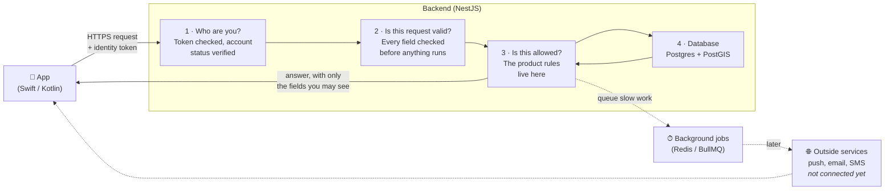
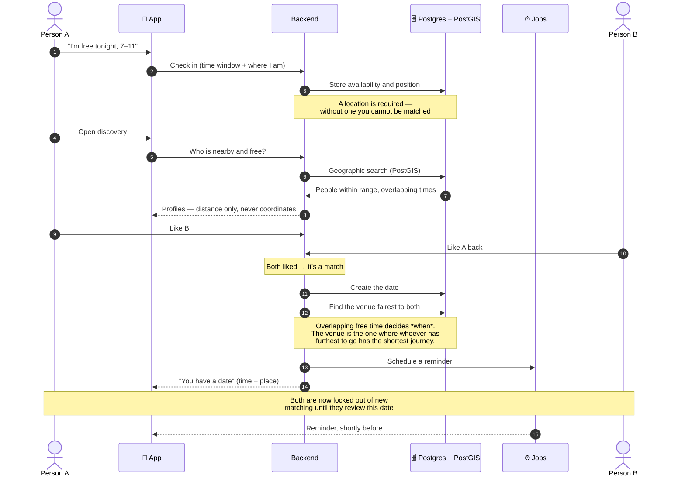
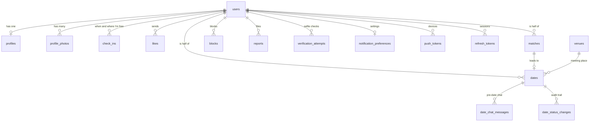

# ShowUp — System Architecture Overview

**SHOWUP-133** · Written 17 August 2026 · Audience: non-developers as well as developers

This describes how ShowUp is built today, in plain language. It is deliberately honest about what
is finished and what is not — the last section lists everything still outstanding and which epic
covers it, so nothing here should be read as a promise that something already works.

> **How complete is this?** The backend is largely built and tested. The mobile apps have not been
> started. Nothing is deployed yet, and no outside service (text messages, email, push
> notifications, photo checks, payments) is connected to a real provider — every one is built and
> wired, but currently answers with a local stand-in. That was a deliberate choice, explained in
> section 5.

---

## 1. What the system is made of

ShowUp is three things: two mobile apps, one backend, and one database. The apps show the screens;
the backend decides what is allowed and what happens; the database remembers it.

| Layer | Technology | What it does | Why this choice |
|---|---|---|---|
| **iOS app** | Native **Swift** | Everything the user sees and taps on iPhone | Not started. Native rather than cross-platform because the product leans on location, camera, push, in-app purchases, secure storage and permission flows — and because a trust-based product that sends people to meet strangers has to feel solid |
| **Android app** | Native **Kotlin** | The same, on Android | As above. Two separate apps, no shared code — a deliberate trade of extra effort for quality and platform fit |
| **Backend** | **Node.js 22** + **NestJS 11** (TypeScript) | The brain. Accounts, profiles, check-ins, matching, date scheduling, safety, notifications | NestJS imposes a clear structure — modules, dependency injection, validation — which keeps a system this size navigable instead of becoming one large file. TypeScript catches whole classes of mistakes before the code runs |
| **Database** | **PostgreSQL 16** with the **PostGIS 3.4** extension | Permanent memory: everything above, stored | Postgres is dependable and free. PostGIS is the reason for choosing it: it does geographic maths *inside* the database, so "who is nearby" is one fast query rather than fetching everyone and measuring in code |
| **Fast temporary store** | **Redis 7** | Short-lived data and the queue of background work | Purpose-built for things that must be fast and need not survive a restart |
| **Background jobs** | **BullMQ 5** (on Redis) | Work that happens on a timer with nobody watching: date reminders, check-in expiry | Some things must happen at a moment in the future, not in response to a tap. This is that machinery |
| **Login** | Phone code, Apple, Google — with **JWT** tokens | Proves who someone is on every request | No passwords at all, so there is no password to leak, reuse or reset. A short-lived token proves identity per request; a longer-lived one renews it |
| **API documentation** | **Swagger / OpenAPI** | A browsable, always-current list of every endpoint | Generated from the code itself, so it cannot drift out of date. This is what the app developers will build against |
| **Error monitoring** | **Sentry** | Reports crashes and unexpected failures with enough context to fix them | Switched off completely for now — no reports go anywhere, and no Sentry account is needed to build or run the system. Turning it on later is a settings change, not new code. Once on, a report says what broke and which account hit it, while contact details, sign-in codes and session data are removed before it leaves us |
| **Analytics** | **PostHog** (EU-hosted) | Product measurement — what people actually do | Hosted in the EU, so the data stays under European privacy law. Real account ids are never sent — each one is replaced by a scrambled code that cannot be turned back into the original. The same person always gets the same code, so we can still tell that one person did five things, without ever learning who that person is |
| **Hosting** | **AWS**, EU region **Ireland (eu-west-1)** | Where the backend and database will run | Nothing is deployed yet, but the provider and region are settled. AWS because three integrations are already written for it (email, photo checks, file storage). Ireland specifically because the live face check used for selfie verification is **only offered in that European region** — and a face is special-category personal data, so it cannot leave the EU. Frankfurt would otherwise be the natural choice for a German product; the verification feature decides it |

### The outside services

These are built into the backend and switched off. Each sits behind a swappable connection point,
so turning one on is a configuration change rather than new code.

| Purpose | Intended provider | Status |
|---|---|---|
| Text messages (login codes) | **Twilio** | Built, logs the code locally instead of sending |
| Email | **AWS SES** | Built, not connected |
| Push notifications | **Firebase Cloud Messaging** | Built, not connected |
| Photo checks (automated) | **AWS Rekognition** | Built, not connected |
| Payments | **Apple In-App Purchase + Google Play Billing**, via **RevenueCat** | Not built — Epic 9 |
| File storage (photos) | **AWS S3** | Not connected |
| Analytics | **PostHog EU** | Built, not connected |

---

## 2. How a request travels through the system

Every request follows the same path. Understanding this one picture explains most of the backend.

**The important properties of this path:**

- **Closed by default.** Every endpoint requires a valid token unless it is explicitly marked
  public. Eight are public: two health checks and the six sign-in routes. A developer who adds a
  new endpoint and forgets about permissions gets a protected one, not an exposed one.
- **Nothing trusted from the app.** Every incoming field is validated at the boundary. Unknown
  fields are rejected outright rather than ignored.
- **The rules live in one place.** The app cannot decide that a date is valid or that someone may
  be matched; the backend decides and the app displays the answer.
- **Slow work is deferred.** Sending a notification does not hold up the response. It is queued and
  happens moments later, so the app never waits on an outside service.

---

## 3. The main user journey, end to end

This is the journey that is fully built and working: from being available, to having a date arranged.

**Two details worth pausing on in the walkthrough:**

**The app never receives anyone's coordinates.** Discovery returns a *distance* and an availability
window — never a position. That is deliberate: there is no live tracking, and location data never
leaves the backend layer that calculates with it.

**The venue is chosen by the backend, not the users.** It picks the place where the person with
further to travel has the shortest journey, from the venues near both of them. Neither person picks
it, so the app has to be visibly even-handed — and it must not send two people ten kilometres each
simply to be perfectly symmetrical.

---

## 4. What we store

Twenty-one tables. Everything hangs off **users**; almost every other table is "something that
belongs to a person" or "something that happened between two people".

| Group | Tables | Holds |
|---|---|---|
| **Person** | `users`, `profiles`, `profile_photos` | Account and login identifiers; then, separately, the public profile and its photos with their moderation state |
| **Availability** | `check_ins` | "I am free between these times, and I am here." Location is a PostGIS point, and it is mandatory |
| **Meeting** | `likes`, `matches`, `dates`, `venues` | Who liked whom, which became mutual, the resulting date with its time and venue, and the venue list |
| **During a date** | `date_chat_messages`, `date_status_changes` | The chat that opens shortly before, and a permanent record of every status change and who made it |
| **Safety** | `blocks`, `reports`, `moderation_status_changes`, `verification_attempts` | Blocking, reporting, moderation decisions, and selfie verification attempts |
| **Messaging** | `notification_preferences`, `push_tokens`, `notification_log` | What someone agreed to receive, which devices to reach, and what was actually sent |
| **Security** | `refresh_tokens`, `phone_verifications`, `email_verifications`, `audit_logs` | Sessions, one-time codes, and an append-only trail of security-significant events |

**One design decision worth explaining.** Deleting a person's row automatically deletes everything
personal that hangs off it — profile, photos, check-ins, likes, matches, dates, chat, blocks,
reports, devices, sessions. But operational records like the audit trail keep their row and simply
forget *who* it was. So the history of what happened survives while the person genuinely disappears
from it.

**Locations are stored as results, not trails.** A check-in holds one point for as long as the
availability window lasts. Arrival at a venue will be stored as a yes/no answer, not as a position.
There is no movement history anywhere in this design.

---

## 5. What is not finished, and where it is handled

Everything below is known and deliberate. It is listed by what it means in practice, with the epic
that completes it.

### Not started

| Gap | Consequence today | Handled in |
|---|---|---|
| **The mobile apps** | Nothing a user can install. The backend is exercised only by automated tests | App development |
| **Hosting and deployment** | The backend runs on a developer machine and nowhere else. Provider and region are settled (AWS, Ireland); which services, what size and what it costs are not | **Epic 20** |
| **Payments** | No premium features, no subscriptions. The module exists as an empty placeholder | **Epic 9** |
| **Admin tools** | Moderators can act through API endpoints, but there is no screen to do it in | **Epic 19** |
| **No-show consequences** | A date can be arranged and marked as a no-show, but nothing happens as a result. The rule (24 hours without matching) is designed and specified, not built | **Epic 8** |

#### How to start on AWS without wasting money

Recorded here so it is not lost, and to be pinned down properly in **Epic 20**. AWS charges whether
or not anybody uses the app, and it gives you every option while configuring none of them — which is
how small teams end up paying for an idle platform.

**Start with the managed pieces on the smallest sizes:** a managed Postgres (with the PostGIS
extension enabled), a managed Redis, and a simple container runner for the backend itself. Managed
means Amazon handles backups, patching and failover rather than us — which matters a great deal when
the same person is also building two mobile apps.

**Turn on a billing alert on day one**, before anything else is created. It is the difference between
noticing an unexpected cost in a day and noticing it on the monthly invoice.

**Leave the expensive-by-default parts until there are real users.** Network address translation
gateways, multi-zone redundancy and Kubernetes all cost real money every month and solve problems a
pre-launch product does not have yet. They can be added later without rebuilding anything.

### Built but not connected

Every outside service is finished in code and answers with a local stand-in instead of contacting a
real provider. **This is intentional:** connecting them costs money and requires credentials, and
several of them cannot be set up until the app exists, since they need real app identities.

Two do *not* depend on the app and involve waiting for someone else's approval — email
(sending beyond a sandbox) and text messages (registering a sender for German numbers). Those are
worth starting early so they are not discovered during launch week.

### Working, but with a known weakness

| Weakness | Why it matters | Handled in |
|---|---|---|
| **Account deletion does not fully delete** | Asking to delete marks the account and signs the person out everywhere, but the final clearing of data never runs — nothing schedules it. A "deleted" account still holds its profile, photos and history | **Epic 15** |
| **Consent is not recorded** | Analytics has a consent check built in, but there is nowhere yet to store what a person actually agreed to | **Epic 15** |
| **Some tests bypass the web layer** | Six test files drive the backend's internals directly rather than sending real requests, so they cannot catch a missing permission check. Permissions are separately verified on all 52 endpoints | **Epic 18** (partly done) |
| **Venue list is a demo table** | Venues hold only a name and a position — no address, opening hours or category. Venue quality directly determines how fair a date's location feels | Not yet scheduled |
| **Automated photo checks are a stand-in** | Photos can be moderated by hand; nothing screens them automatically yet | **Epic 20 / SHOWUP-119** |

### Deliberate trade-offs, not gaps

- **Distance is straight-line, not travel time.** Estimating real travel time means assuming how
  someone gets there. Guessing public transport for someone who walks or drives would quietly make
  a "fair" split unfair. Distance is the same fact for everyone.
- **All tests share one database and run one at a time.** Simple and reliable; it means the test
  suite takes about a minute rather than seconds.
- **The venue search is bounded.** Only venues in a circle between the two people are considered.
  This keeps the query fast as the venue list grows, and stops the app proposing somewhere neither
  person wants to go.

---

## 6. How we know it works

- **311 automated checks** of individual rules, run in seconds
- **158 end-to-end checks** that start the real backend against a real database and exercise it
  through actual requests
- **Permissions verified on all 52 endpoints** — every one refuses a request with no identity, and
  every administrative one refuses an ordinary signed-in user
- **Everything runs automatically on every change.** A change that breaks the build, the style
  rules, or any test cannot be merged into the main version — this is enforced, not requested
- **Health checks** the hosting platform can use to tell whether the app is alive and whether it can
  reach the database and Redis

The main branch was, until recently, failing these checks without anyone knowing. Enforcement was
turned on, the two underlying problems were fixed, and it now passes.
